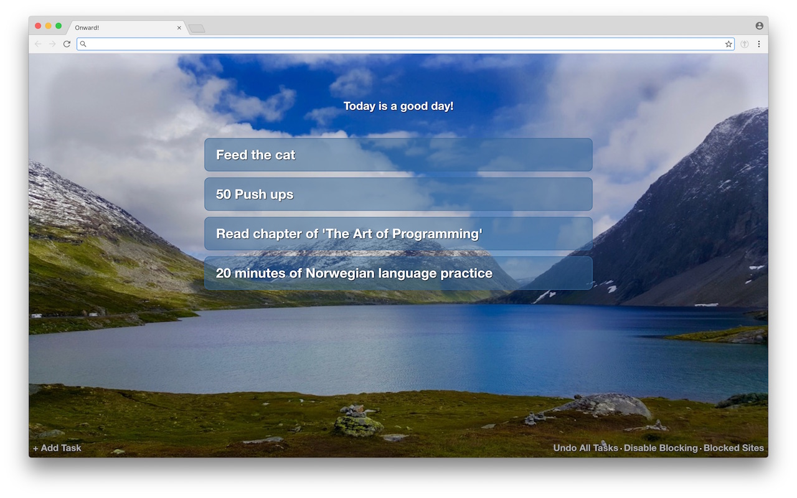

# Onward!
### ...is a desktop Chrome Extension that blocks addictive sites until you've completed your daily tasks.

## Sounds dumb. How Does it Work?
**Onward!** is a simple attempt to stop you from thoughtlessly surfing-- until you've completed a few daily tasks that you've set for yourself. Every time you open a new window or tab in Chrome, the Onward! page appears, listing the tasks you need to complete for the day.  If you finish a task, click on the corresponding button and it will go away.  If you complete them all, then Onward! no longer blocks you when you attempt to visit the sites found on your Blocked Sites list.

The next day (specifically, right after midnight), when you next open a window or tab, the tasks will reappear.  They are *daily* tasks, after all. If you want to get rid of a task forever (I mean, like, if you really want to stop feeding the cat, ok) then hover over the task and you will see a little link titled "Delete Permanently"

## Those links at the bottom

* **Add Task** - That's how you add new tasks to your Daily Task list
* **Undo All Tasks** - Let's say you finish all your tasks for the day but suddenly feel the need to *do them all again today*.  This button is for you.  All your daily tasks will reappear.
* **Disable Blocking** - Listen, we're all human. Sometimes we haven't finished our daily tasks but still need to post something brilliant on Twitter or whatever.  This button will disable all blocking *but only for the current window*.  If you open a new window or tab, it's back to blocking.  This is for your own good. Notice also how the button changes to "Enable Blocking" if blocking is currently disabled.
* **Blocked Sites** - Click this to see the list of blocked sites. Add or remove sites as you wish. The syntax to use [seems to be this](https://www.chromium.org/administrators/url-blacklist-filter-format), but in general you're just going to want to type `*://*.NAMEOFEVILSITE.com/`

## Installing the Extension via the Chrome Webstore vs Using this Repo

Part of the reason I wrote this extension was because it feels weird clicking OK to this:

By writing my own plugin, I know for sure that it isn't tracking me or doing any other nefarious business (at least not intentionally) Open sourcing the thing allows you to take a look at the code and install it locally so you too are sure it only does what it says on the tin.

But hey, if you want to roll the dice (or 5 star this thing), it's [on the Chrome Webstore here](https://chrome.google.com/webstore/detail/onward/jloeebmoepejjjalnmppbbgklclomhoj).

## Customizing

* Do you hate that beautiful photo of central Norway? Are you already envisioning your own css "theme"?
	* Check out `styles.css`
* Do you find the text messages cloying?
	* Check out `homepage.html`

## What Onward! is not

* A full featured To Do List app. Lord knows the world doesn't need another one of those.
* Dependent on external Javascript libraries. This makes it easier to interrigate the codebase to make sure it's not doing anything evil.
* Bug free.  In fact, it's probably pretty easy to break it. Sorry.

## Product Roadmap
 
This product is finished.  New versions will be pushed if bugs are found.  If you want more features, fork.

Hope you find this extension useful.  Studies show extended use makes thoughless surfing up to *37% less guilt enducing*!
